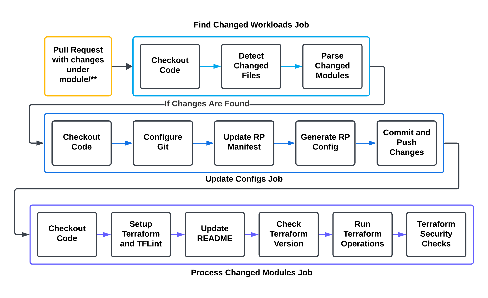
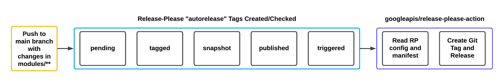

# Findings and Observations

## Experiment Context

Versioning Terraform modules allows for stability and predictability when deploying infrastructure. It prevents unpredictable changes by enabling teams to pin to specific module versions and upgrade deliberately. There is ongoing debate about whether or when to use a monorepo or polyrepo approach when structuring Terraform module repositories in an organization, as both approaches offer different trade-offs for managing versioned modules and access control. While it is ultimately up to preference, the key considerations for this experiment are simplicity, managing the lifecycle of modules, and managing access control to the modules.

## Diagrams

### Modules Pull Request Workflow

### Release-Please Workflow

## Implementation Summary

GitHub Actions is used as a platform for this experiment. When a pull request is submitted, a Python script identifies changed or new modules, amends Release-Please configuration and manifest, and includes these changes in the pull request. All Terraform code undergoes linting, validation checks, and security checks, with additional checks possible.

Release Please maintains Release PRs that track changes as work is merged into the main branch. It uses Conventional Commit messages to determine version updates: 'fix:' for patches, 'feat:' for minor versions, and commits with '!' (like 'feat!:') for major versions. When the Release PR is merged, Release Please updates change logs, creates versioned tags, and generates GitHub Releases. This process maintains independent versioning for each module within the repository. The resulting versions can be referenced by module resources, Terragrunt, or other orchestration tools. If the labels that Release-Please requires are created if they do not already exist. If they were not created then Release-Please did not always function properly. 

## What Worked Well

The Release Please GitHub Action and the automation built around it performs as expected, updating change logs, creating versioned tags, and generating GitHub Releases predictably and reliably once established. While the custom Python scripts and GitHub Actions may need additional safeguards against undesired changes, this experiment demonstrates that module lifecycles can be effectively managed in a monorepo, monorepo-like, or polyrepo structure while maintaining relative simplicity.

## What Needs Work

- Release Please requires a maintained configuration file for versioning modules. When configured to create separate pull requests per module, merge conflicts can occur during the git tag and release step if multiple modules are modified simultaneously. While these conflicts are straightforward to resolve, they create unnecessary friction. Using a single pull request for all modules avoids this issue. The organization needs to evaluate whether single or multiple release pull requests better suit their needs, and further testing is needed to explore alternative approaches.
- Additional testing of GitHub Actions workflows and associated code before deployment is necessary to prevent issues in production environments, though this falls outside the scope of the current experiment and there may not be a complete solution.

## Lessons Learned

A monorepo can effectively manage Terraform module lifecycles, but falls short in providing robust access control solutions. While managing multiple repositories offers superior access control capabilities, this approach introduces additional operational overhead. Organizations must carefully evaluate their specific requirements when deciding between monorepo and polyrepo architectures for Terraform modules to determine the most suitable solution.

## Next Steps

- Begin additional Terraform operational experiments, leveraging the newly established module versioning system.
- Create additional modules for a basic multi-account AWS environment.

## Resources

- [Conventional Commits](https://www.conventionalcommits.org/en/v1.0.0/) - A specification for adding human and machine readable meaning to commit messages
- [Release Please GitHub Action](https://github.com/googleapis/release-please) - Automate CHANGELOG generation, versioning, and release creationd version management and package release using Conventional Commit messages